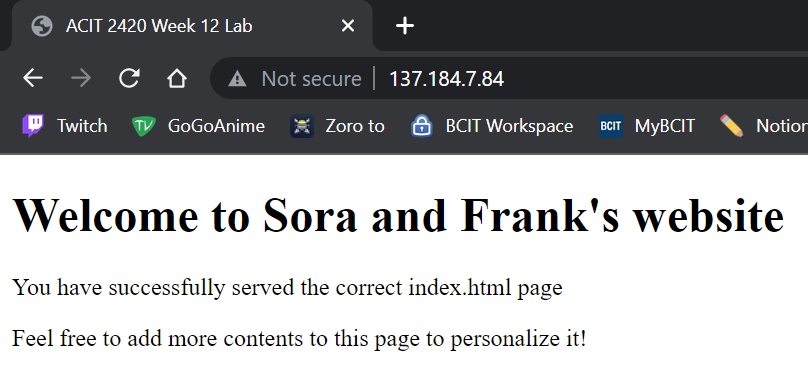

# ACIT 2420 Lab 12

Created By: Frank Zhu and Sora Schlegel

## Table of Contents

- [Requirements Before Starting](#requirements-before-starting)
- [Installing NGINX](#installing-nginx)
- [Create an HTML File to Serve](#create-an-html-file-to-serve)
- [Writing an NGINX Server Block](#writing-an-nginx-server-block)
- [Moving Files to web-one](#moving-files-to-web-one)
- [Restart NGINX](#restart-nginx)
- [Check The IP Address in Browser](#check-the-ip-address-in-browser)
- [Setting Up Firewall Using UFW](#setting-up-firewall-using-ufw)
- [Testing Firewall](#testing-firewall)

- **Note Before Starting:** We will be creating the files using WSL then transfering the files to "web-one". Where the files are created does not matter currently, but when transfering the files, this will matter.

---

## Requirements Before Starting

- Note: Before beginning this lab, you must create a new server with the hostname set to "web-one" on DigitalOcean.

1. Create a new SSH key.

2. Create a new droplet on DigitalOcean with the hostname set to "web-one".

3. Create a new user on "web-one".

4. Disable login as the root user.

---

## Installing NGINX

1. Check if there are any updates to be made on your system by using the commmand below.

	`sudo apt update`

	`sudo apt upgrade`

2. To install NGINX, use the command below.

	`sudo apt install nginx`

3. When prompted, "Do You Want To Continue?" Type in "Y" and hit the `Enter` key.

- Note: The download should begin and a progress bar should appear at the bottom of the terminal like the screen shot below.


4. When the screen with the image below pops up, press `Tab` on your keyboard then press `Enter`


You have now successfully installed NGINX

---

## Create an HTML File to Serve

1. Create a "index.html" file by using the command below.

	`touch index.html`

2. Add the following contents inside the HTML file using the `vim` tool.

	```
	<!DOCTYPE html>
	<html lang="en">
	<html>
    		<head>
			<meta charset="UTF-8" />
        		<title>Example Site for 2420</title>
    		</head>
    		<body>
        		<h1>Success!</h1>
        		<h2 style="color: red;">All your internets are belong to us!</h2>
    		</body>
	</html>
	```

You have now successfully created the index.html document

---

## Writing an NGINX Server Block

1. Create a file with the file name set as the IP address for your DigitalOcean server.

	`touch 137.184.7.84`

2. Add the following contents to the file created in step 1 by using the `vim` tool.

	```
	server {
        	listen 80;
        	listen [::]:80;

        	root /var/www/137.184.7.84/html;
        	index index.html;

        	server_name 137.184.7.84;

        	location / {
                	try_files $uri $uri/ =404;
        	}
	}	
	```

- Note: The IP address shown above will be different. Use the IP address for web-one created on DigitalOcean.

You have successfully created the server block for NGINX

---

## Moving Files to web-one

1. On your local terminal, change the directory to the folder that contains the files we created in step 2 and 3.

2. Create the `/var/www/137.184.7.84/html` directory on "web-one" by using the commands below.

	`cd /var/www`

	`sudo mkdir -p 137.184.7.84/html`


3. Use the `sftp` command to copy the files.

4. Copy the `index.html` and `137.184.7.84` file to the home directory of your web-one user by using the commad below.

- Note: The IP address for web-one will be the folder name inside the `/var/www` directory.

	`sftp -i ~/.ssh/DO_webone_key sora-web@137.184.7.84`

	`put index.html`

	`put 137.184.7.84`

- Note: You can verify that the file was successfully copied by checking the directory in "web-one"


5. SSH into web-one and move the copied HTML file to the `/var/www/137.184.7.84/html` directory by using the command below.

	`sudo cp ./index.html /var/www/137.184.7.84/html`

- Note: Verify that the file exists in the directory by using the `ls` command.


6. Copy the `137.184.7.84` file to the `/etc/nginx/sites-available` directory.

	`sudo cp ./137.184.7.84 /etc/nginx/sites-available`

- Note: You can verify that the file was successfully copied by checking the directory in "web-one"


7. Create a soft link to the new server block by using the command below.

	`sudo ln -s /etc/nginx/sites-available/137.184.7.84 /etc/nginx/sites-enabled/`

8. Test your nginx configuration by using the command below.

	`sudo nginx -t`

- Note: If successful, you should have a similar output to the screen shot below.


You have successfully setup the proper configuration for nginx

---

## Restart NGINX

1. Use the command below to restart the nginx service.

	`sudo systemctl restart nginx`

- Note: There wont be any outputs to this command.

2. Verify that the restart was successful by using the command below.

	`sudo systemctl status nginx`


You ave successfully restarted the nginx service

---

## Check The IP Address in Browser

1. Copy the IP address to "web-one" server

2. Paste it in the browser.

- Note: If done correctly, the webpage being served should look similar to the screen shot below.


You have successfully served the index.html file

---

## Setting Up Firewall Using UFW

1. Check if UFW is enabled by using the command below.

	`sudo ufw status`


2. Enable SSH and HTTP connections by using the command below.

	`sudo ufw allow ssh`

	`sudo ufw allow http`


- Note: Since I have already enabled ssh and http, the output after running the command will be different in your case.

3. Enable to the UFW Firewall by using the command below.

	`sudo ufw enable`


4. Check the list of rules by using the command below.

	`sudo ufw status`


You have successfully created the firewall using UFW

---

## Testing Firewall

1. Try accessing "web-one" server using SSH from your local terminal. You should still be able to access the server.


2. Try accessing the HTML file being served by searching the IP address of "web-one". The same webpage should be displayed when we accessed the webpage earlier in the Lab.



You have successfully enabled the Firewall

